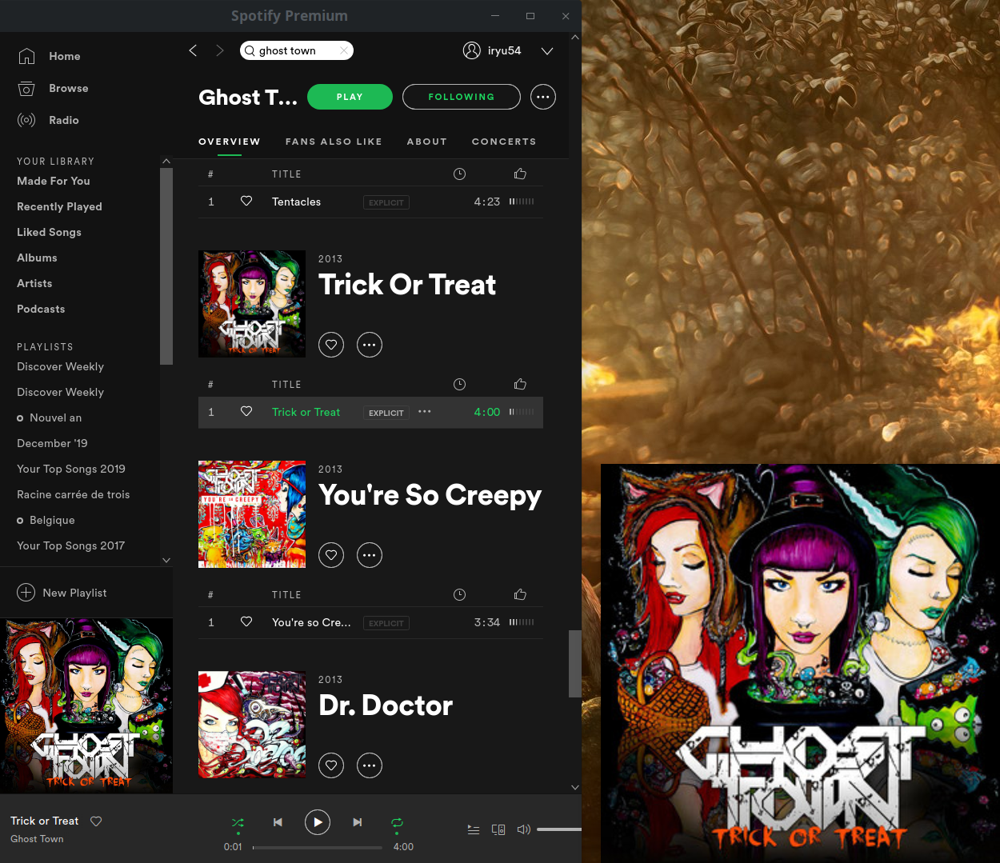
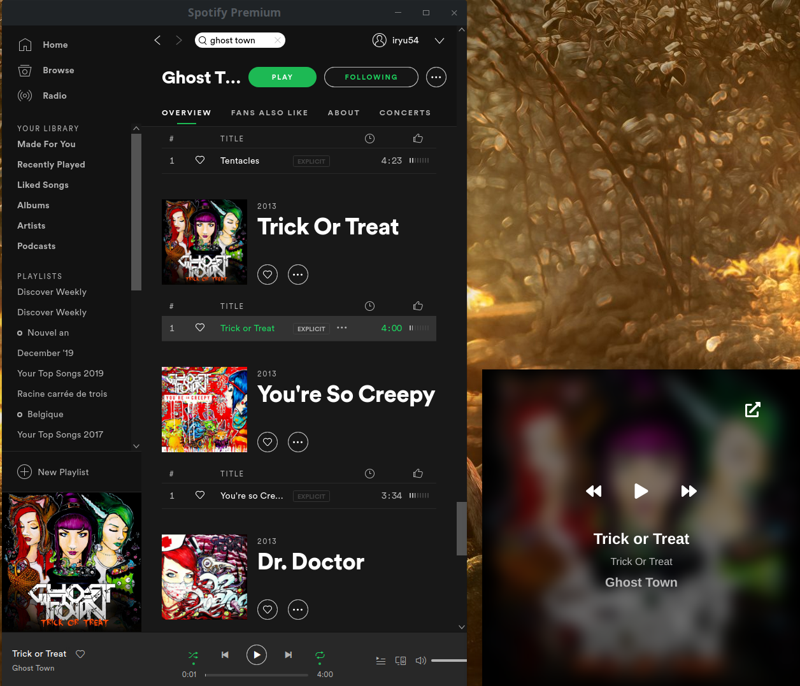
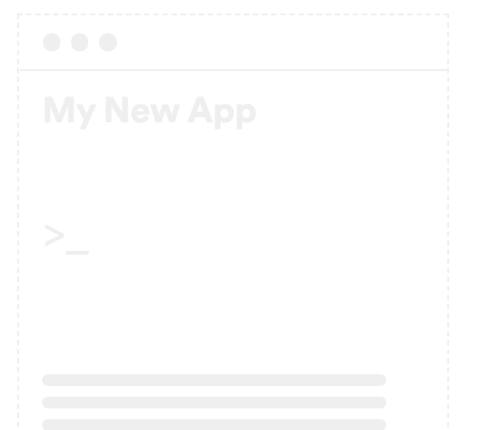
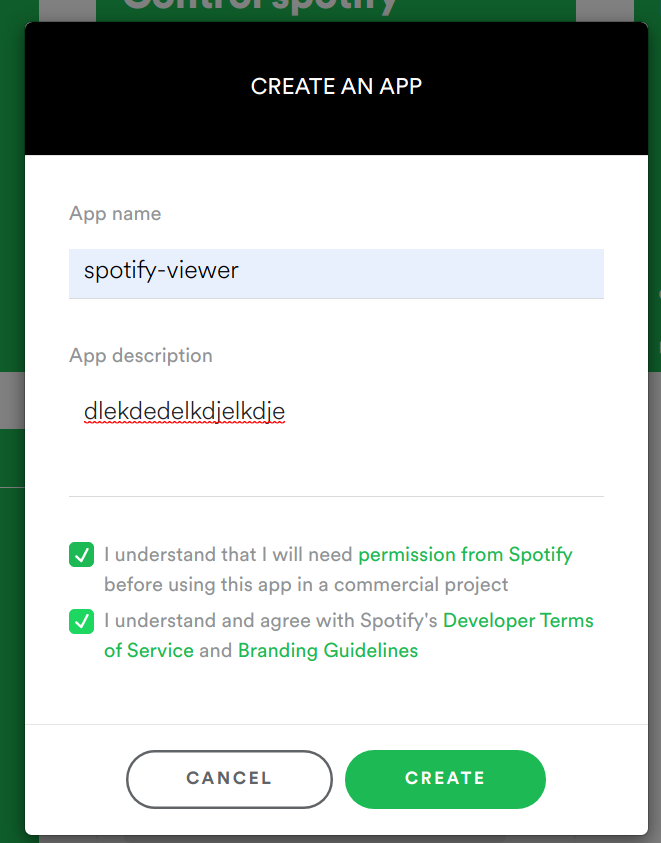
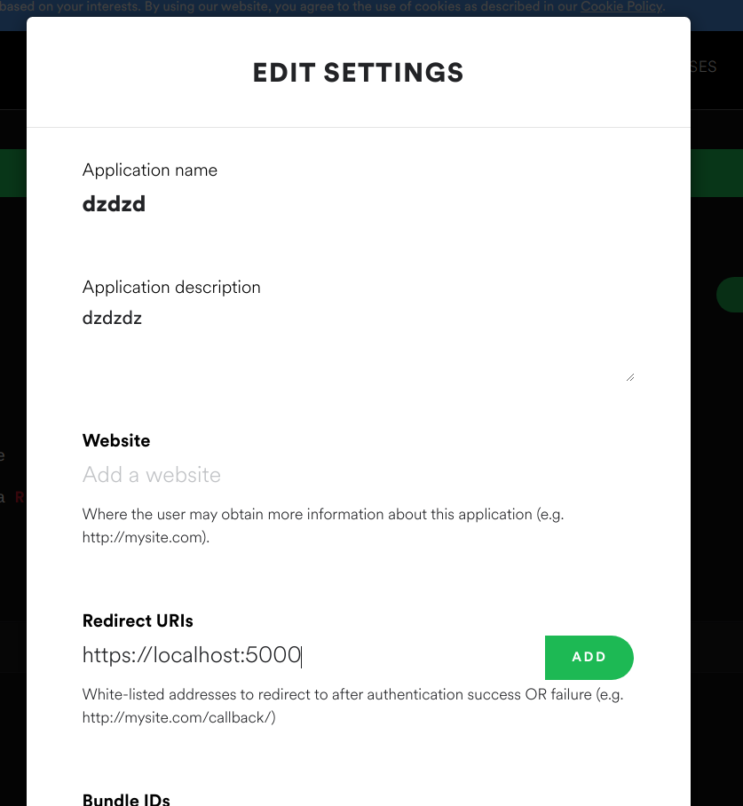
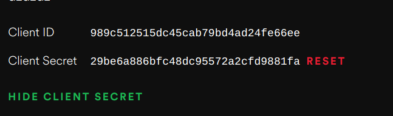

# Spotify-preview

Show what you listen to in all circumstances

## Features
- Stay in the foreground 
- Starts Spotify if it is not started
- Control Spotify if it is started with dbus (regular account)
- Control Spotify with WebAPI (you need a client_id and a client_secret on developer [dashboard](https://developer.spotify.com/dashboard/applications) with your premium account)
- Show album cover
- Show artist name
- Show album name
- Show music title
- Can skip to the next song
- Can skip to the previous song
- Can play/pause song
- Bring Spotify back to the foreground

## Screenshots



## Download
- Go to [github realease page](https://github.com/clabroche/spotify-preview/releases)
- Download appImage

## Get a client id
Go to your [dashboard](https://developer.spotify.com/dashboard/applications) here



Click on create app



Click on edit settings and fill redirect URIs


That's it

## Developpement

I don't have time to develop and test on a distribution other than Archlinux. AppImage should be fine for most distribution. 
If you feel like it, send me pull requests for other platforms.

Serve:
``` bash
npm run serve
```

Build:
``` bash
npm run build
```

Deploy:

Github Action build electron and push it to realease tab  when a tag is encountered.

